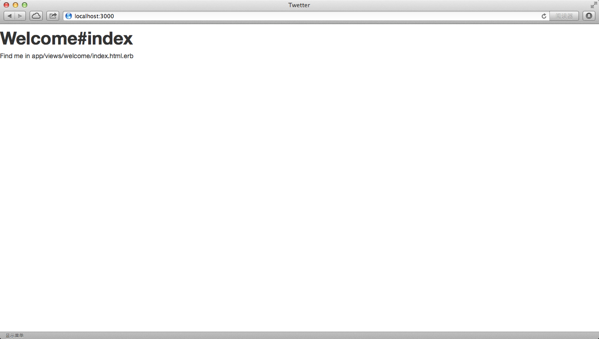

# Style Twetter using bootstrap

## Configure Gemfile

### add gem 'twitter-bootstrap-rails'
	limingth@gmail ~/Github/myTwetter/Twetter$ vi Gemfile
	  1 source 'https://rubygems.org'
	  2 
	  3 # Bundle edge Rails instead: gem 'rails', github: 'rails/rails'
	  4 gem 'rails', '4.0.2'
	  5 
	  6 # Use sqlite3 as the database for Active Record
	  7 gem 'sqlite3'
	  8 
	  9 # Use SCSS for stylesheets
	 10 gem 'sass-rails', '~> 4.0.0'
	 11 
	 12 gem 'twitter-bootstrap-rails'
	 13 gem 'less-rails'
	 14 gem 'therubyracer'
	 15 
	 16 # Use Uglifier as compressor for JavaScript assets
	 17 gem 'uglifier', '>= 1.3.0'

### bundle install
	limingth@gmail ~/Github/myTwetter/Twetter$ bundle install
	Resolving dependencies...
	Using rake (10.1.0) 
	Using i18n (0.6.9) 
	Using minitest (4.7.5) 
	Using multi_json (1.8.2) 
	Using atomic (1.1.14) 
	Using thread_safe (0.1.3) 
	Using tzinfo (0.3.38) 
	Using activesupport (4.0.2) 
	Using builder (3.1.4) 
	Using erubis (2.7.0) 
	Using rack (1.5.2) 
	Using rack-test (0.6.2) 
	Using actionpack (4.0.2) 
	Using mime-types (1.25.1) 
	Using polyglot (0.3.3) 
	Using treetop (1.4.15) 
	Using mail (2.5.4) 
	Using actionmailer (4.0.2) 
	Using activemodel (4.0.2) 
	Using activerecord-deprecated_finders (1.0.3) 
	Using arel (4.0.1) 
	Using activerecord (4.0.2) 
	Using bundler (1.3.5) 
	Using coffee-script-source (1.6.3) 
	Using execjs (2.0.2) 
	Using coffee-script (2.2.0) 
	Using thor (0.18.1) 
	Using railties (4.0.2) 
	Using coffee-rails (4.0.1) 
	Using commonjs (0.2.7) 
	Using hike (1.2.3) 
	Using jbuilder (1.5.3) 
	Using jquery-rails (3.0.4) 
	Using json (1.8.1) 
	Using less (2.4.0) 
	Using less-rails (2.4.2) 
	Using libv8 (3.16.14.3) 
	Using tilt (1.4.1) 
	Using sprockets (2.10.1) 
	Using sprockets-rails (2.0.1) 
	Using rails (4.0.2) 
	Using rdoc (3.12.2) 
	Using ref (1.0.5) 
	Using sass (3.2.12) 
	Using sass-rails (4.0.1) 
	Using sdoc (0.3.20) 
	Using sqlite3 (1.3.8) 
	Using therubyracer (0.12.0) 
	Using turbolinks (2.1.0) 
	Using twitter-bootstrap-rails (2.2.8) 
	Using uglifier (2.3.3) 
	Your bundle is complete!
	Use `bundle show [gemname]` to see where a bundled gem is installed.

## Using bootstrap

### run the twitter-bootstrap-rails install generator
	limingth@gmail ~/Github/myTwetter/Twetter$ rails generate bootstrap:install
	      insert  app/assets/javascripts/application.js
	      create  app/assets/javascripts/bootstrap.js.coffee
	      create  app/assets/stylesheets/bootstrap_and_overrides.css.less
	      create  config/locales/en.bootstrap.yml
	        gsub  app/assets/stylesheets/application.css
	        gsub  app/assets/stylesheets/application.css
	limingth@gmail ~/Github/myTwetter/Twetter$ 

### restart rails server
	limingth@gmail ~/Github/myTwetter/Twetter$ rails s
	=> Booting WEBrick
	=> Rails 4.0.2 application starting in development on http://0.0.0.0:3000
	=> Run `rails server -h` for more startup options
	=> Ctrl-C to shutdown server
	[2013-12-19 10:34:13] INFO  WEBrick 1.3.1
	[2013-12-19 10:34:13] INFO  ruby 2.0.0 (2013-06-27) [x86_64-darwin12.4.0]
	[2013-12-19 10:34:13] INFO  WEBrick::HTTPServer#start: pid=12195 port=3000

### Refresh web browser localhost:3000
	Welcome#index

	Find me in app/views/welcome/index.html.erb

* see the style is changed

