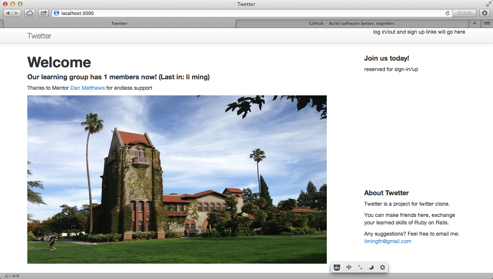

# Use SQLite3 as database and Create the User Model

## Setup SQLite3 

### see Gemfile
	limingth@gmail ~/Github/myTwetter/Twetter$ cat Gemfile | grep sql
	# Use sqlite3 as the database for Active Record
	gem 'sqlite3'
	limingth@gmail ~/Github/myTwetter/Twetter$ 

### use sqlite3 in console
	limingth@gmail ~/Github/myTwetter/Twetter$ sqlite3 
	SQLite version 3.8.1 2013-10-17 12:57:35
	Enter ".help" for instructions
	Enter SQL statements terminated with a ";"
	sqlite> .help
	.backup ?DB? FILE      Backup DB (default "main") to FILE
	.bail ON|OFF           Stop after hitting an error.  Default OFF
	.databases             List names and files of attached databases
	.dump ?TABLE? ...      Dump the database in an SQL text format
	                         If TABLE specified, only dump tables matching
	                         LIKE pattern TABLE.
	.echo ON|OFF           Turn command echo on or off
	.exit                  Exit this program
	.explain ?ON|OFF?      Turn output mode suitable for EXPLAIN on or off.
	                         With no args, it turns EXPLAIN on.
	.header(s) ON|OFF      Turn display of headers on or off
	.help                  Show this message
	.import FILE TABLE     Import data from FILE into TABLE
	.indices ?TABLE?       Show names of all indices
	                         If TABLE specified, only show indices for tables
	                         matching LIKE pattern TABLE.
	.load FILE ?ENTRY?     Load an extension library
	.log FILE|off          Turn logging on or off.  FILE can be stderr/stdout
	.mode MODE ?TABLE?     Set output mode where MODE is one of:
	                         csv      Comma-separated values
	                         column   Left-aligned columns.  (See .width)
	                         html     HTML <table> code
	                         insert   SQL insert statements for TABLE
	                         line     One value per line
	                         list     Values delimited by .separator string
	                         tabs     Tab-separated values
	                         tcl      TCL list elements
	.nullvalue STRING      Use STRING in place of NULL values
	.output FILENAME       Send output to FILENAME
	.output stdout         Send output to the screen
	.print STRING...       Print literal STRING
	.prompt MAIN CONTINUE  Replace the standard prompts
	.quit                  Exit this program
	.read FILENAME         Execute SQL in FILENAME
	.restore ?DB? FILE     Restore content of DB (default "main") from FILE
	.schema ?TABLE?        Show the CREATE statements
	                         If TABLE specified, only show tables matching
	                         LIKE pattern TABLE.
	.separator STRING      Change separator used by output mode and .import
	.show                  Show the current values for various settings
	.stats ON|OFF          Turn stats on or off
	.tables ?TABLE?        List names of tables
	                         If TABLE specified, only list tables matching
	                         LIKE pattern TABLE.
	.timeout MS            Try opening locked tables for MS milliseconds
	.trace FILE|off        Output each SQL statement as it is run
	.vfsname ?AUX?         Print the name of the VFS stack
	.width NUM1 NUM2 ...   Set column widths for "column" mode
	.timer ON|OFF          Turn the CPU timer measurement on or off
	sqlite> .databases
	seq  name             file                                                      
	---  ---------------  ----------------------------------------------------------
	0    main                                                                       
	sqlite> .exit
	limingth@gmail ~/Github/myTwetter/Twetter$ 

## Create the User Model

### rails generate model User name:string username:string
	limingth@gmail ~/Github/myTwetter/Twetter$ rails generate model User name:string username:string
	      invoke  active_record
	      create    db/migrate/20131219205929_create_users.rb
	      create    app/models/user.rb
	      invoke    test_unit
	      create      test/models/user_test.rb
	      create      test/fixtures/users.yml
	limingth@gmail ~/Github/myTwetter/Twetter$ 

### check new files generated
	limingth@gmail ~/Github/myTwetter/Twetter$ cat app/models/user.rb 
	class User < ActiveRecord::Base
	end
	limingth@gmail ~/Github/myTwetter/Twetter$ cat db/migrate/20131219205929_create_users.rb 
	class CreateUsers < ActiveRecord::Migration
	  def change
	    create_table :users do |t|
	      t.string :name
	      t.string :username

	      t.timestamps
	    end
	  end
	end
	limingth@gmail ~/Github/myTwetter/Twetter$ cat test/models/user_test.rb 
	require 'test_helper'

	class UserTest < ActiveSupport::TestCase
	  # test "the truth" do
	  #   assert true
	  # end
	end
	limingth@gmail ~/Github/myTwetter/Twetter$ 

### rake db:migrate
	limingth@gmail ~/Github/myTwetter/Twetter$ rake db:create
	db/development.sqlite3 already exists
	limingth@gmail ~/Github/myTwetter/Twetter$ rake db:migrate
	==  CreateUsers: migrating ====================================================
	-- create_table(:users)
	   -> 0.0036s
	==  CreateUsers: migrated (0.0042s) ===========================================

	limingth@gmail ~/Github/myTwetter/Twetter$ 

### create First user by hand
	limingth@gmail ~/Github/myTwetter/Twetter$ rails c
	Loading development environment (Rails 4.0.2)
	2.0.0-p247 :001 > User
	 => User(no database connection) 
	2.0.0-p247 :002 > User.count
	   (0.7ms)  SELECT COUNT(*) FROM "users"
	 => 0 
	2.0.0-p247 :003 > User
	 => User(id: integer, name: string, username: string, created_at: datetime, updated_at: datetime) 
	2.0.0-p247 :004 > a = User.new(name:"li ming", username:"limingth")
	 => #<User id: nil, name: "li ming", username: "limingth", created_at: nil, updated_at: nil> 
	2.0.0-p247 :005 > a.save
	   (2.4ms)  begin transaction
	  SQL (51.9ms)  INSERT INTO "users" ("created_at", "name", "updated_at", "username") VALUES (?, ?, ?, ?)  [["created_at", Thu, 19 Dec 2013 21:06:03 UTC +00:00], ["name", "li ming"], ["updated_at", Thu, 19 Dec 2013 21:06:03 UTC +00:00], ["username", "limingth"]]
	   (1.2ms)  commit transaction
	 => true 
	2.0.0-p247 :006 > User
	 => User(id: integer, name: string, username: string, created_at: datetime, updated_at: datetime) 
	2.0.0-p247 :007 > User.count
	   (0.5ms)  SELECT COUNT(*) FROM "users"
	 => 1 
	2.0.0-p247 :008 > User.first
	  User Load (0.5ms)  SELECT "users".* FROM "users" ORDER BY "users"."id" ASC LIMIT 1
	 => #<User id: 1, name: "li ming", username: "limingth", created_at: "2013-12-19 21:06:03", updated_at: "2013-12-19 21:06:03"> 
	2.0.0-p247 :009 > User.last
	  User Load (0.4ms)  SELECT "users".* FROM "users" ORDER BY "users"."id" DESC LIMIT 1
	 => #<User id: 1, name: "li ming", username: "limingth", created_at: "2013-12-19 21:06:03", updated_at: "2013-12-19 21:06:03"> 
	2.0.0-p247 :010 > exit
	limingth@gmail ~/Github/myTwetter/Twetter$ 

## test db connection with controller
### modify welcome controller
	limingth@gmail ~/Github/myTwetter/Twetter$ vi app/controllers/welcome_controller.rb 
	  1 class WelcomeController < ApplicationController
	  2   def index
	  3     @users = User.order(updated_at: :desc)
	  4   end
	  5 end

### modify welcome index view
	limingth@gmail ~/Github/myTwetter/Twetter$ vi app/views/welcome/index.html.erb 
	  1 <h1>Welcome</h1>
	  2 <h4>Our learning group has <%= @users.count %> members now! (Last in: <%= @users.last.name %>)</h4>
	  3 
Thanks to Mentor <a href="mailto:dan@bluefoc.us">Dan Matthews</a> for endless support

### Refresh web browser localhost:3000
	Welcome
	Our learning group has 1 members now! (Last in: li ming)

* see the database is connected through welcome controller

### git commit 

## Done!
see next step [Add attributes and Sign Up Form](4-add-attributes-and-signup-form.md)
