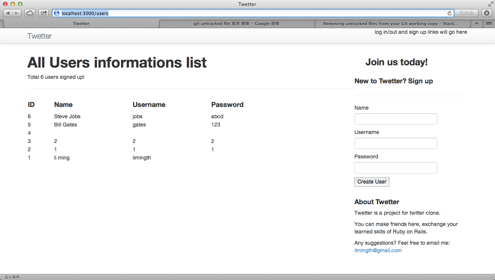

# Add attributes and Sign Up Form

## Add Sign Up Form

* refer to
<http://api.rubyonrails.org/classes/ActionView/Helpers/FormHelper.html>

### add render partial sign up 
	limingth@gmail ~/Github/myTwetter/Twetter$ vi app/views/layouts/application.html.erb
	 28        

	 29           <h3>Join us today!</h3>
	 30           

	 31             <%= render :partial => 'sign_up' %>
	 32        

### add sign up form
	limingth@gmail ~/Github/myTwetter/Twetter$ vi app/views/welcome/_sign_up.html.erb 
	

	  

	    

	      <h4>New to Twetter? Sign up</h4>
	    

	    

	    

	        <%= form_for @user do |f| %>
	          <%= f.label :name %>
	          <%= f.text_field :name %> 

	          <%= f.label :username %>
	          <%= f.text_field :username %> 

	          <%= f.submit %>
	        <% end %>

	  

	
    

### add users as a resource
	limingth@gmail ~/Github/myTwetter/Twetter$ vi config/routes.rb 
	  1 Twetter::Application.routes.draw do
	  2   get "welcome/index"
	  3   # The priority is based upon order of creation: first created -> highest priority.
	  4   # See how all your routes lay out with "rake routes".
	  5 
	  6   # You can have the root of your site routed with "root"
	  7   root 'welcome#index'
	  8   resources :users

### refresh web browser localhost:3000
* now you can see sign up form with 2 text field

### git commit
	limingth@gmail ~/Github/myTwetter/Twetter$ git status
	# On branch master
	# Changes not staged for commit:
	#   (use "git add <file>..." to update what will be committed)
	#   (use "git checkout -- <file>..." to discard changes in working directory)
	#
	#	modified:   ../3-setup-database-and-user-model.md
	#	modified:   ../README.md
	#	modified:   app/controllers/welcome_controller.rb
	#	modified:   app/views/layouts/application.html.erb
	#	modified:   config/routes.rb
	#
	# Untracked files:
	#   (use "git add <file>..." to include in what will be committed)
	#
	#	../4-add-attributes-and-signup-form.md
	#	app/views/welcome/_sign_in.html.erb
	#	app/views/welcome/_sign_up.html.erb
	#	../view-add-sign-up-form.png
	no changes added to commit (use "git add" and/or "git commit -a")
	limingth@gmail ~/Github/myTwetter/Twetter$ git add ..
	limingth@gmail ~/Github/myTwetter/Twetter$ git add .
	limingth@gmail ~/Github/myTwetter/Twetter$ git commit -a -m "Add Sign Up Form"
	[master c747c18] Add Sign Up Form
	 9 files changed, 143 insertions(+), 9 deletions(-)
	 create mode 100644 4-add-attributes-and-signup-form.md
	 create mode 100644 Twetter/app/views/welcome/_sign_in.html.erb
	 create mode 100644 Twetter/app/views/welcome/_sign_up.html.erb
	 create mode 100644 view-add-sign-up-form.png
	limingth@gmail ~/Github/myTwetter/Twetter$ git push
	Counting objects: 31, done.
	Delta compression using up to 2 threads.
	Compressing objects: 100% (17/17), done.
	Writing objects: 100% (18/18), 793.16 KiB | 0 bytes/s, done.
	Total 18 (delta 10), reused 0 (delta 0)
	To git@github.com:limingth/myTwetter.git
	   3633646..c747c18  master -> master
	limingth@gmail ~/Github/myTwetter/Twetter$ 

## Add password attributes to User model

### rails generate migration AddPasswordToUsers password:string
	limingth@gmail ~/Github/myTwetter/Twetter$ rails generate migration AddPasswordToUsers password:string
	      invoke  active_record
	      create    db/migrate/20131219230746_add_password_to_users.rb
	limingth@gmail ~/Github/myTwetter/Twetter$ 

### rake db:migrate
	limingth@gmail ~/Github/myTwetter/Twetter$ rake db:migrate
	==  AddPasswordToUsers: migrating =============================================
	-- add_column(:users, :password, :string)
	   -> 0.0105s
	==  AddPasswordToUsers: migrated (0.0108s) ====================================

### add password text field to sign up form
	limingth@gmail ~/Github/myTwetter/Twetter$ vi app/views/welcome/_sign_up.html.erb 
	  9     

	 10         <%= form_for @user do |f| %>
	 11           <%= f.label :name %>
	 12           <%= f.text_field :name %> 
	 13 
	 14           <%= f.label :username %>
	 15           <%= f.text_field :username %> 
	 16 
	 17           <%= f.label :password%>
	 18           <%= f.text_field :password%> 
	 19           
	 20           <%= f.submit %>
	 21         <% end %>
	 22     

### refresh web browser localhost:3000
* now you can see sign up form with 2 text field

### git commit
	limingth@gmail ~/Github/myTwetter/Twetter$ git status
	# On branch master
	# Changes not staged for commit:
	#   (use "git add <file>..." to update what will be committed)
	#   (use "git checkout -- <file>..." to discard changes in working directory)
	#
	#	modified:   ../1-rails-new-twetter.md
	#	modified:   ../4-add-attributes-and-signup-form.md
	#	modified:   app/views/welcome/_sign_up.html.erb
	#	modified:   db/schema.rb
	#
	# Untracked files:
	#   (use "git add <file>..." to include in what will be committed)
	#
	#	db/migrate/20131219230746_add_password_to_users.rb
	#	../view-add-password.png
	no changes added to commit (use "git add" and/or "git commit -a")
	limingth@gmail ~/Github/myTwetter/Twetter$ git add ..
	limingth@gmail ~/Github/myTwetter/Twetter$ git add .
	limingth@gmail ~/Github/myTwetter/Twetter$ git commit -a -m "Add password attributes to User model"
	[master be0b4bc] Add password attributes to User model
	 6 files changed, 90 insertions(+), 2 deletions(-)
	 create mode 100644 Twetter/db/migrate/20131219230746_add_password_to_users.rb
	 create mode 100644 view-add-password.png
	limingth@gmail ~/Github/myTwetter/Twetter$ git push
	Counting objects: 25, done.
	Delta compression using up to 2 threads.
	Compressing objects: 100% (14/14), done.
	Writing objects: 100% (14/14), 795.16 KiB | 0 bytes/s, done.
	Total 14 (delta 6), reused 0 (delta 0)
	To git@github.com:limingth/myTwetter.git
	   c747c18..be0b4bc  master -> master
	limingth@gmail ~/Github/myTwetter/Twetter$ 

#### however, when you submit the form, there will be a error message
	Routing Error
	uninitialized constant UsersController

	Rails.root: /Users/limingth/Github/myTwetter/Twetter

## Form submit function implementation

### rails generate controller user new
	limingth@gmail ~/Github/myTwetter/Twetter$ rails generate controller users new
	      create  app/controllers/user_controller.rb
	       route  get "user/new"
	      invoke  erb
	      create    app/views/user
	      create    app/views/user/new.html.erb
	      invoke  test_unit
	      create    test/controllers/user_controller_test.rb
	      invoke  helper
	      create    app/helpers/user_helper.rb
	      invoke    test_unit
	      create      test/helpers/user_helper_test.rb
	      invoke  assets
	      invoke    coffee
	      create      app/assets/javascripts/user.js.coffee
	      invoke    scss
	      create      app/assets/stylesheets/user.css.scss
	limingth@gmail ~/Github/myTwetter/Twetter$ 

### modify users_controller.rb 
	limingth@gmail ~/Github/myTwetter/Twetter$ vi app/controllers/users_controller.rb 
	class UsersController < ApplicationController
	  def new
	    @user = User.new
	  end

	  def create
	    @user = User.new(user_params)
	    if @user.save
	      redirect_to root_url, notice: "Thank you for signing up"
	    else
	      render "new"
	    end
	  end

	  private 
	    def user_params
	      params.require(:user).permit(:name, :username, :password)
	    end
	end
	limingth@gmail ~/Github/myTwetter/Twetter$ 

### add index view to user
	limingth@gmail ~/Github/myTwetter/Twetter$ vi app/views/users/index.html.erb 
	<h1>All Users informations list</h1>
	

	Total <%= @users.count %> users signed up! 

	<table width=100%>
	  <tr>
	    <td width=10%><h4>ID</td>
	    <td width=30%><h4>Name</td>
	    <td width=30%><h4>Username</td>
	    <td width=30%><h4>Password</td>
	  </tr>

	  <% @users.each do |u| %>
	  <tr>
	    <td><%= u.id %></td>
	    <td><%= u.name %></td>
	    <td><%= u.username %></td>
	    <td><%= u.password %></td>
	  </tr>
	  <% end %>

	</table>

### cp _sign_up.html.erb to users folder
	limingth@gmail ~/Github/myTwetter/Twetter$ cp app/views/welcome/_sign_up.html.erb app/views/users/

### add index function
	limingth@gmail ~/Github/myTwetter/Twetter$ vi app/controllers/users_controller.rb 
	  1 class UsersController < ApplicationController
	  2 
	  3   def index
	  4     @user = User.new
	  5     @users = User.order(updated_at: :desc)
	  6   end 
	  7   
	  8   def new
	  9     @user = User.new
	 10   end

### refresh web browser http://localhost:3000/users

* see all the users info

### git commit

## Done!

