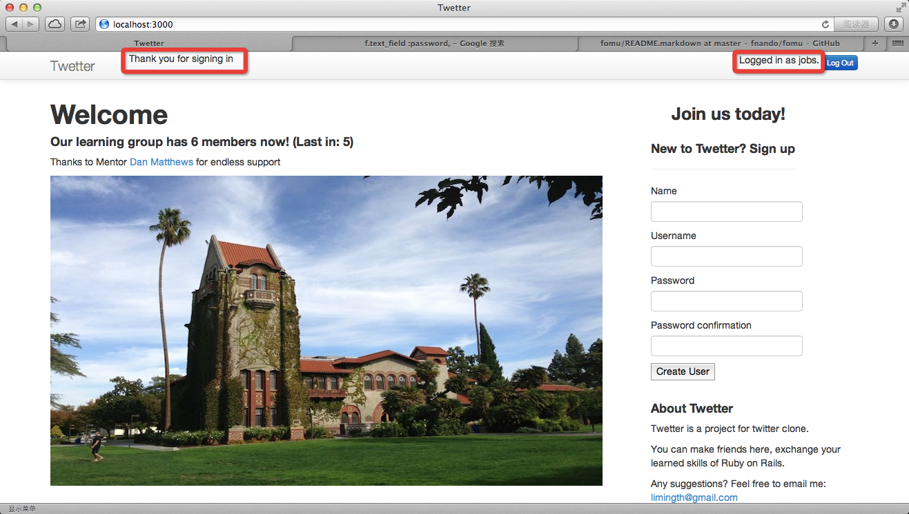

# Add User Authentication feature

## Improve password feature for sign up 

### rails g resource user name username password_digest
	limingth@gmail ~/Github/myTwetter/Twetter$ rm db/migrate/*
	rm: db/migrate/*: No such file or directory
	limingth@gmail ~/Github/myTwetter/Twetter$ rm db/*.sqlite3
	limingth@gmail ~/Github/myTwetter/Twetter$ rails g resource user name username password_digest
	      invoke  active_record
	      create    db/migrate/20131220195132_create_users.rb
	   identical    app/models/user.rb
	      invoke    test_unit
	   identical      test/models/user_test.rb
	   identical      test/fixtures/users.yml
	      invoke  controller
	   identical    app/controllers/users_controller.rb
	      invoke    erb
	       exist      app/views/users
	      invoke    test_unit
	   identical      test/controllers/users_controller_test.rb
	      invoke    helper
	   identical      app/helpers/users_helper.rb
	      invoke      test_unit
	   identical        test/helpers/users_helper_test.rb
	      invoke    assets
	      invoke      coffee
	   identical        app/assets/javascripts/users.js.coffee
	      invoke      scss
	   identical        app/assets/stylesheets/users.css.scss
	      invoke  resource_route
	       route    resources :users
	limingth@gmail ~/Github/myTwetter/Twetter$ 

### check user schema
	limingth@gmail ~/Github/myTwetter/Twetter$ cat db/migrate/20131220195132_create_users.rb 
	class CreateUsers < ActiveRecord::Migration
	  def change
	    create_table :users do |t|
	      t.string :name
	      t.string :username
	      t.string :password_digest

	      t.timestamps
	    end
	  end
	end
	limingth@gmail ~/Github/myTwetter/Twetter$ 

### rake db:migrate
	limingth@gmail ~/Github/myTwetter/Twetter$ rake db:migrate
	==  CreateUsers: migrating ====================================================
	-- create_table(:users)
	   -> 0.0038s
	==  CreateUsers: migrated (0.0040s) ===========================================

	limingth@gmail ~/Github/myTwetter/Twetter$ 

### using the Ruby gem bcrypt 
	limingth@gmail ~/Github/myTwetter/Twetter$ vi Gemfile
	 38 
	 39 # Use ActiveModel has_secure_password
	 40 gem 'bcrypt-ruby', '~> 3.1.2'
	 41 

* just uncomment line 40

### bundle install
	limingth@gmail ~/Github/myTwetter/Twetter$ bundle install
	Resolving dependencies...
	Using rake (10.1.0) 
	Using i18n (0.6.9) 
	Using minitest (4.7.5) 
	Using multi_json (1.8.2) 
	Using atomic (1.1.14) 
	Using thread_safe (0.1.3) 
	Using tzinfo (0.3.38) 
	Using activesupport (4.0.2) 
	Using builder (3.1.4) 
	Using erubis (2.7.0) 
	Using rack (1.5.2) 
	Using rack-test (0.6.2) 
	Using actionpack (4.0.2) 
	Using mime-types (1.25.1) 
	Using polyglot (0.3.3) 
	Using treetop (1.4.15) 
	Using mail (2.5.4) 
	Using actionmailer (4.0.2) 
	Using activemodel (4.0.2) 
	Using activerecord-deprecated_finders (1.0.3) 
	Using arel (4.0.1) 
	Using activerecord (4.0.2) 
	Using bcrypt-ruby (3.1.2) 
	Using bundler (1.3.5) 
	Using coffee-script-source (1.6.3) 
	Using execjs (2.0.2) 
	Using coffee-script (2.2.0) 
	Using thor (0.18.1) 
	Using railties (4.0.2) 
	Using coffee-rails (4.0.1) 
	Using commonjs (0.2.7) 
	Using hike (1.2.3) 
	Using jbuilder (1.5.3) 
	Using jquery-rails (3.0.4) 
	Using json (1.8.1) 
	Using less (2.4.0) 
	Using less-rails (2.4.2) 
	Using libv8 (3.16.14.3) 
	Using tilt (1.4.1) 
	Using sprockets (2.10.1) 
	Using sprockets-rails (2.0.1) 
	Using rails (4.0.2) 
	Using rdoc (3.12.2) 
	Using ref (1.0.5) 
	Using sass (3.2.12) 
	Using sass-rails (4.0.1) 
	Using sdoc (0.3.20) 
	Using sqlite3 (1.3.8) 
	Using therubyracer (0.12.0) 
	Using turbolinks (2.1.0) 
	Using twitter-bootstrap-rails (2.2.8) 
	Using uglifier (2.3.3) 
	Your bundle is complete!
	Use `bundle show [gemname]` to see where a bundled gem is installed.
	limingth@gmail ~/Github/myTwetter/Twetter$ 

### add has_secure_password to User
	limingth@gmail ~/Github/myTwetter/Twetter$ vi app/models/user.rb 
	class User < ActiveRecord::Base

	  has_secure_password

	  validates_uniqueness_of :username
	  validates :name, presence: true
	  validates :username, presence: true

	end

### add create and index to users controller
	limingth@gmail ~/Github/myTwetter/Twetter$ vi app/controllers/users_controller.rb 
	class UsersController < ApplicationController

	  def index
	    @users = User.all
	    @user = User.new
	  end 

	  def new 
	    @user = User.new
	  end 

	  def create
	    @user = User.new(user_params)
	    if @user.save
	      redirect_to root_url, notice: "Thank you for signing up" 
	    else
	      redirect_to root_url, notice: "Sorry, Signing up failed"
	    end 
	  end 

	  private 
	    def user_params
	      params.require(:user).permit(:name, :username, :password, :password_confirmation)
	    end 

	end

* note here: password_confirmation is a must for has_secure_password feature, so do NOT miss it

### change sign up form
	limingth@gmail ~/Github/myTwetter/Twetter$ vi app/views/welcome/_sign_up.html.erb 
	  8     
	  9     

	 10         <%= form_for @user do |f| %>
	 11           <%= f.label :name %>
	 12           <%= f.text_field :name %> 
	 13           
	 14           <%= f.label :username %>
	 15           <%= f.text_field :username %> 
	 16           
	 17           <%= f.label :password%>
	 18           <%= f.text_field :password%> 
	 19           
	 20           <%= f.label :password_confirmation %>
	 21           <%= f.text_field :password_confirmation :type => "password" %> 
	 22           
	 23           <%= f.submit %>
	 24         <% end %>
	 25     

	 26   

* note here: we must add password_confirmation input so that has_secure_password feature can work

### change welcome index page view
	limingth@gmail ~/Github/myTwetter/Twetter$ vi app/views/welcome/index.html.erb 
	  1 <h1>Welcome</h1>
	  2 <% if @users.count %>
	  3   <h4>Our learning group has <%= @users.count %> members now! (Last in: <%= @users.first.name %>)</h4>
	  4 <% else %>
	  5   <h4>Our learning group has <%= @users.count %> members now! </h4> 
	  6 <% end %>

### add flash message to navbar
	limingth@gmail ~/Github/myTwetter/Twetter$ vi app/views/layouts/application.html.erb 
	 11 

	 12   

	 13     

	 14       <%= link_to "Twetter", root_path, :class => "brand" %>
	 15       
	 16           

	 17             <% flash.each do |name, msg| %>
	 18               <%= content_tag :div, msg, id: "flash_#{name}" %>
	 19             <% end %>
	 20           

	 21       
	 22       
log in/out and sign up links will go here

	 23     

	 24   

	 25 
 

### restart rails server
	limingth@gmail ~/Github/myTwetter/Twetter$ rails s
	=> Booting WEBrick
	=> Rails 4.0.2 application starting in development on http://0.0.0.0:3000
	=> Run `rails server -h` for more startup options
	=> Ctrl-C to shutdown server
	[2013-12-20 11:59:10] INFO  WEBrick 1.3.1
	[2013-12-20 11:59:10] INFO  ruby 2.0.0 (2013-06-27) [x86_64-darwin12.4.0]
	[2013-12-20 11:59:10] INFO  WEBrick::HTTPServer#start: pid=17310 port=3000

### refresh web browser localhost:3000

* see the sign up form is changed

* fill the 4 boxes and click Create User

### git commit
	limingth@gmail ~/Github/myTwetter/Twetter$ git add --ignore-removal .
	limingth@gmail ~/Github/myTwetter/Twetter$ git status
	# On branch master
	# Changes to be committed:
	#   (use "git reset HEAD <file>..." to unstage)
	#
	#	new file:   ../.DS_Store
	#	new file:   ../5-add-user-authentication-feature.md
	#	modified:   Gemfile
	#	modified:   Gemfile.lock
	#	modified:   app/controllers/users_controller.rb
	#	modified:   app/models/user.rb
	#	modified:   app/views/layouts/application.html.erb
	#	modified:   app/views/welcome/_sign_up.html.erb
	#	modified:   app/views/welcome/index.html.erb
	#	new file:   db/migrate/20131220195132_create_users.rb
	#	modified:   db/schema.rb
	#	modified:   test/controllers/users_controller_test.rb
	#	modified:   test/fixtures/users.yml
	#	new file:   ../signup-password-feature.png
	#	new file:   ../signup-success.png
	#
	# Changes not staged for commit:
	#   (use "git add/rm <file>..." to update what will be committed)
	#   (use "git checkout -- <file>..." to discard changes in working directory)
	#
	#	deleted:    db/migrate/20131219205929_create_users.rb
	#	deleted:    db/migrate/20131219230746_add_password_to_users.rb
	#
	limingth@gmail ~/Github/myTwetter/Twetter$ git commit -a -m "Improve password feature for sign up"
	[master 368bafc] Improve password feature for sign up
	 16 files changed, 437 insertions(+), 22 deletions(-)
	 create mode 100644 .DS_Store
	 create mode 100644 5-add-user-authentication-feature.md
	 delete mode 100644 Twetter/db/migrate/20131219230746_add_password_to_users.rb
	 rename Twetter/db/migrate/{20131219205929_create_users.rb => 20131220195132_create_users.rb} (84%)
	 create mode 100644 signup-password-feature.png
	 create mode 100644 signup-success.png
	limingth@gmail ~/Github/myTwetter/Twetter$ git push
	Counting objects: 52, done.
	Delta compression using up to 2 threads.
	Compressing objects: 100% (28/28), done.
	Writing objects: 100% (29/29), 1.59 MiB | 0 bytes/s, done.
	Total 29 (delta 13), reused 0 (delta 0)
	To git@github.com:limingth/myTwetter.git
	   ede1e55..368bafc  master -> master
	limingth@gmail ~/Github/myTwetter/Twetter$ 

## Create Sessions and Add log in/out feature 

### create a SessionsController with a new action
	limingth@gmail ~/Github/myTwetter/Twetter$ rails g controller sessions new
	      create  app/controllers/sessions_controller.rb
	       route  get "sessions/new"
	      invoke  erb
	      create    app/views/sessions
	      create    app/views/sessions/new.html.erb
	      invoke  test_unit
	      create    test/controllers/sessions_controller_test.rb
	      invoke  helper
	      create    app/helpers/sessions_helper.rb
	      invoke    test_unit
	      create      test/helpers/sessions_helper_test.rb
	      invoke  assets
	      invoke    coffee
	      create      app/assets/javascripts/sessions.js.coffee
	      invoke    scss
	      create      app/assets/stylesheets/sessions.css.scss
	limingth@gmail ~/Github/myTwetter/Twetter$ 

### take a look at routes.rb
	limingth@gmail ~/Github/myTwetter/Twetter$ vi config/routes.rb 
	  1 Twetter::Application.routes.draw do
	  2   get "sessions/new"
	  3 #  get "users/new"
	  4 #  get "welcome/index"

### configure sessions as a resource
	limingth@gmail ~/Github/myTwetter/Twetter$ vi config/routes.rb 
	  1 Twetter::Application.routes.draw do
	  2   get "sessions/new"
	  3   resources :sessions
	  4 

### alter the create action on UsersController
	limingth@gmail ~/Github/myTwetter/Twetter$ vi app/controllers/users_controller.rb 
	 13   def create
	 14     @user = User.new(user_params)
	 15     if @user.save
	 16       session[:user_id] = @user.id
	 17       redirect_to root_url, notice: "Thank you for signing up"
	 18     else
	 19       redirect_to root_url, notice: "Sorry, Signing up failed"
	 20     end
	 21   end

### set a @current_user instance variable in ApplicationController
	limingth@gmail ~/Github/myTwetter/Twetter$ vi app/controllers/application_controller.rb 
	class ApplicationController < ActionController::Base
	  # Prevent CSRF attacks by raising an exception.
	  # For APIs, you may want to use :null_session instead.
	  protect_from_forgery with: :exception

	  private
	  def current_user
	    @current_user ||= User.find(session[:user_id]) if session[:user_id]
	  end 

	  helper_method :current_user

	end

### add some conditional logic to the navbar
	limingth@gmail ~/Github/myTwetter/Twetter$ vi app/views/layouts/application.html.erb 
	 16         

	 17           <% flash.each do |name, msg| %>
	 18             <%= content_tag :div, msg, id: "flash_#{name}" %>
	 19           <% end %>
	 20         

	 21 
	 22         

	 23            <% if current_user %>
	 24               Logged in as <%= current_user.username %>.
	 25               

	 26                 <%= link_to "Log Out", session_path("current"), method: 'delete', :class => 'btn btn-primary btn-mini' %>
	 27               

	 28             <% else %>
	 29               

	 30                  <%= form_tag sessions_path do %>
	 31                      <%= text_field_tag :username, params[:username], :placeholder=>"Enter username" %> 
	 32                      <%= text_field_tag :password, params[:password], :placeholder=>"Enter password", :type => "password" %>
	 33                      <%= submit_tag "Log In" %>
	 34                  <% end %>
	 35               

	 36             <% end %>
	 37         
 

* refer to http://getbootstrap.com/css/#forms-inline

### create and destroy action on our sessions controller
	limingth@gmail ~/Github/myTwetter/Twetter$ vi app/controllers/sessions_controller.rb 
	class SessionsController < ApplicationController
	  def new 
	  end 

	  def create
	    user = User.find_by_username(params[:username])
	    if user && user.authenticate(params[:password])  
	      session[:user_id] = user.id
	      redirect_to root_url, notice: "Thank you for signing in" 
	    else
	      if not user
	        redirect_to root_url, notice: "Sorry, Signing in failed, user not exists"
	      else
	        redirect_to root_url, notice: "Sorry, Signing in failed, password not correct"
	      end 
	    end 
	  end 

	  def destroy
	    session[:user_id] = nil 
	    redirect_to root_url, notice: "Logged out"
	  end 

	end

### refresh web browser localhost:3000

* see the log in form is in a single line

* fill the 2 boxes and click Log in

* click Log out

### git commit
