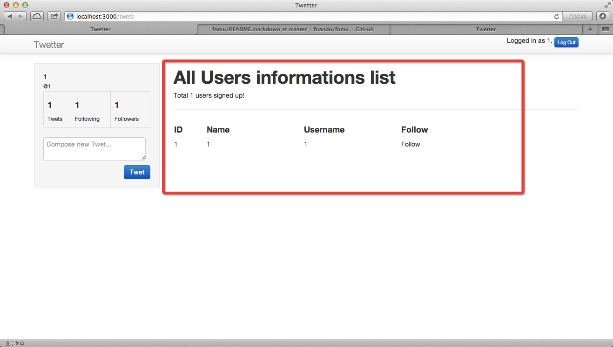
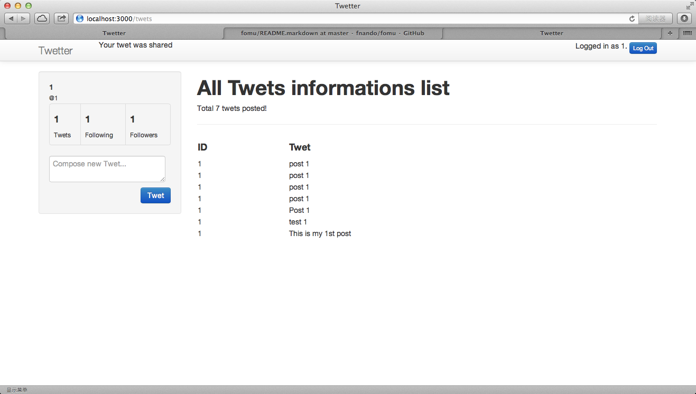
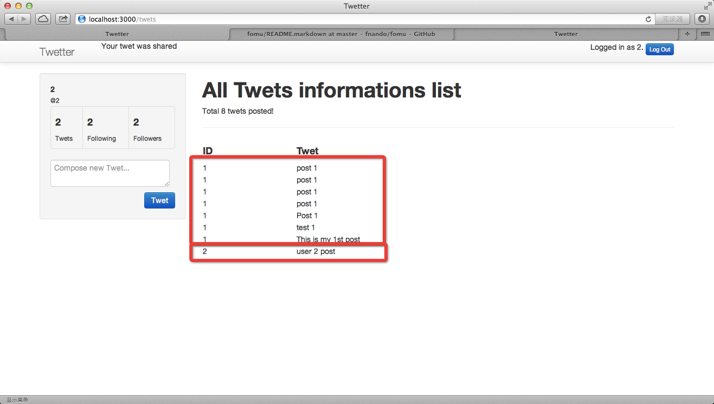

# Add Tweets data model

## Re-layout the application

### change sessions layout to authed.html.erb
	limingth@gmail ~/Github/myTwetter/Twetter$ vi app/controllers/sessions_controller.rb 
	  1 class SessionsController < ApplicationController
	  2   layout 'authed'
	  3 
	  4   def new
	  5   end

### modify sessions create method
	  7   def create
	  8     @users = User.all
	  9     user = User.find_by_username(params[:username])
	 10     if user && user.authenticate(params[:password])
	 11       session[:user_id] = user.id
	 12       render 'new', notice: "thank youfor signing up"
	 13     else
	 14       if not user
	 15         redirect_to root_url, notice: "Sorry, Signing in failed, user not exists"
	 16       else
	 17         redirect_to root_url, notice: "Sorry, Signing in failed, password not correct"
	 18       end
	 19     end
	 20   end

### add authed.html.erb
	limingth@gmail ~/Github/myTwetter/Twetter$ vi app/views/layouts/authed.html.erb
	<!DOCTYPE html>
	<html>
	<head>
	  <title>Twetter</title>
	  <%= stylesheet_link_tag    "application", media: "all", "data-turbolinks-track" => true %>
	  <%= javascript_include_tag "application", "data-turbolinks-track" => true %>
	  <%= csrf_meta_tags %>
	</head>
	<body>

	

	  

	    

	      <%= link_to "Twetter", root_path, :class => "brand" %>

	        

	          <% flash.each do |name, msg| %>
	            <%= content_tag :div, msg, id: "flash_#{name}" %>
	          <% end %>
	        

		

		   <% if current_user %>
	              Logged in as <%= current_user.username %>.
		      

			<%= link_to "Log Out", session_path("current"), method: 'delete', :class => 'btn btn-primary btn-mini' %>
		      

	           <% end %>	 
		

	     

	  

	

	

	  

	    

		

		  <ul class="nav nav-pills nav-stacked well text-left">
		    <li>
		      <%= content_tag :strong, current_user.name %>
		    </li>
		    <li>
		      <%= content_tag :small, '@'+current_user.username %>
		    </li>
		    <li>
			      <table class="table table-bordered stats">
				<tbody>
				  <tr>
				    <td>
				      <%= content_tag :h4, current_user.id %>
				      <%= content_tag :small, 'Twets', :class => "uppercase lighter" %>
				    </td>
				    <td>
				      <%= content_tag :h4, current_user.username %>
				      <%= content_tag :small, 'Following', :class => "uppercase lighter" %>
				    </td>
				    <td>
				      <%= content_tag :h4, current_user.username %>
				      <%= content_tag :small, 'Followers', :class => "uppercase lighter" %>
				    </td>
				</tbody>
			      </table>
		    </li>
		    <li>
			    <%= form_for (@twet || :twet), :url => 'twets_path',
						 :method => :POST,
						 :role => :form do |f| %>
			      

				<%= content_tag :div do %>
				  <%= f.text_area :content, :placeholder => "Compose new Twet...", :class => 'form-control', :height => "500" %>
				<% end %>
				<%= f.submit "Twet", :class => "btn btn-primary pull-right" %>
			      

			    <% end %>
		    </li>
		

	    

	    

	       <%= render :partial => 'shared/user_list' %>
	    

	  

	

	</body>
	</html>

### add _user_list.html.erb
	limingth@gmail ~/Github/myTwetter/Twetter$ vi app/views/shared/_user_list.html.erb
	<h1>All Users informations list</h1>
	Total <%= @users.count %> users signed up! 

	<table width=80%>
	

	  <tr>
	    <td width=10%><h4>ID</td>
	    <td width=30%><h4>Name</td>
	    <td width=30%><h4>Username</td>
	    <td width=30%><h4>Follow</td>
	  </tr>

	  <% @users.each do |u| %>
	  <tr>
	    <td><%= u.id %></td>
	    <td><%= u.name %></td>
	    <td><%= u.username %></td>
	    <td>Follow</td>
	  </tr>
	  <% end %>

	</table> 

### modify users create method
	limingth@gmail ~/Github/myTwetter/Twetter$ vi app/controllers/users_controller.rb 
	 13   def create
	 14     @users = User.all
	 15     @user = User.new(user_params)
	 16     if @user.save
	 17       session[:user_id] = @user.id
	 18       render 'new', notice: "thank youfor signing up"
	 19     else
	 20       redirect_to root_url, notice: "Sorry, Signing up failed"
	 21     end
	 22   end

### change sessions layout to authed.html.erb
	limingth@gmail ~/Github/myTwetter/Twetter$ vi app/controllers/users_controller.rb 
	  1 class UsersController < ApplicationController
	  2   layout 'authed'
	  3 

### try log in and sign up

* see authed.html.erb and user_list is working 

### git commit
	limingth@gmail ~/Github/myTwetter/Twetter$ git commit -a -m "Re-layout the application"
	[master 05471dc] Re-layout the application
	 8 files changed, 344 insertions(+), 3 deletions(-)
	 create mode 100644 6-add-tweets-data-model.md
	 create mode 100644 Twetter/app/views/layouts/authed.html.erb
	 create mode 100644 Twetter/app/views/shared/_user_list.html.erb
	 create mode 100644 login-layout.png
	limingth@gmail ~/Github/myTwetter/Twetter$ git push
	Counting objects: 25, done.
	Delta compression using up to 2 threads.
	Compressing objects: 100% (15/15), done.
	Writing objects: 100% (16/16), 123.92 KiB | 0 bytes/s, done.
	Total 16 (delta 7), reused 0 (delta 0)
	To git@github.com:limingth/myTwetter.git
	   9e1e1f1..05471dc  master -> master
	limingth@gmail ~/Github/myTwetter/Twetter$ 

## Add Twet model

### restart rails server and log in

* if you post something in Twet Compose Box, there will be error message

		Routing Error
		No route matches [POST] "/twets_path"

		Rails.root: /Users/limingth/Github/myTwetter/Twetter

### modify authed.html.erb to change url
	limingth@gmail ~/Github/myTwetter/Twetter$ vi app/views/layouts/authed.html.erb 
	 65             <li>
	 66                     <%= form_for (@twet || :twet), :url => twets_path,
	 67                                          :method => :POST,
	 68                                          :role => :form do |f| %>
	 69                       

	 70                         <%= content_tag :div do %>
	 71                           <%= f.text_area :content, :placeholder => "Compose new Twet...", :class => 'form-control', :height => "500" %>
	 72                         <% end %>
	 73                         <%= f.submit "Twet", :class => "btn btn-primary pull-right" %>
	 74                       

	 75                     <% end %>
	 76             </li>

*  refresh web browser

		NameError in Sessions#create
		Showing /Users/limingth/Github/myTwetter/Twetter/app/views/layouts/authed.html.erb where line #66 raised:

		undefined local variable or method `twets_path' for #<#<Class:0x007fe403e4a978>:0x007fe403b6a988>

### rails g resource twet
	limingth@gmail ~/Github/myTwetter/Twetter$ rails g resource twet
	      invoke  active_record
	      create    db/migrate/20131221171909_create_twets.rb
	      create    app/models/twet.rb
	      invoke    test_unit
	      create      test/models/twet_test.rb
	      create      test/fixtures/twets.yml
	      invoke  controller
	      create    app/controllers/twets_controller.rb
	      invoke    erb
	      create      app/views/twets
	      invoke    test_unit
	      create      test/controllers/twets_controller_test.rb
	      invoke    helper
	      create      app/helpers/twets_helper.rb
	      invoke      test_unit
	      create        test/helpers/twets_helper_test.rb
	      invoke    assets
	      invoke      coffee
	      create        app/assets/javascripts/twets.js.coffee
	      invoke      scss
	      create        app/assets/stylesheets/twets.css.scss
	      invoke  resource_route
	       route    resources :twets
	limingth@gmail ~/Github/myTwetter/Twetter$ 

* close web browser and re-open web browser and log in, you will see this

		ActiveRecord::PendingMigrationError
		Migrations are pending; run 'bin/rake db:migrate RAILS_ENV=development' to resolve this issue.

### rake db:migrate RAILS_ENV=development
	limingth@gmail ~/Github/myTwetter/Twetter$ rake db:migrate RAILS_ENV=development
	==  CreateTwets: migrating ====================================================
	-- create_table(:twets)
	   -> 0.0168s
	==  CreateTwets: migrated (0.0172s) ===========================================

	limingth@gmail ~/Github/myTwetter/Twetter$ 

* in case you encounter some db problem, you can rm and re-create db from the very beginning

		limingth@gmail ~/Github/myTwetter/Twetter$ rm db/development.sqlite3 
		limingth@gmail ~/Github/myTwetter/Twetter$ rake db:migrate
		==  CreateUsers: migrating ====================================================
		-- create_table(:users)
		   -> 0.0045s
		==  CreateUsers: migrated (0.0050s) ===========================================
		limingth@gmail ~/Github/myTwetter/Twetter$ 

* refresh web browser and log in

		Unknown action
		The action 'create' could not be found for TwetsController

### add create method 
	limingth@gmail ~/Github/myTwetter/Twetter$ vi app/controllers/twets_controller.rb 
	class TwetsController < ApplicationController

	  def create
	    @twet = current_user.twets.create(twet_params)
	    if @twet.valid?
	      flash[:success] = "Your twet was shared"
	      #redirect_to :action => :index and return
	    else
	      get_twets
	      flash[:error] = "Your twet could not be saved"
	      #render :action => :index and return
	    end 
	  end 

	  def twet_params
	    params.require(:twet).permit(:content)
	  end 

	end

* refresh web browser

		NoMethodError in TwetsController#create
		undefined method `twets' for #<User:0x007fc13d94f6c8>

### add twets to User
	limingth@gmail ~/Github/myTwetter/Twetter$ vi app/models/user.rb
	  1 class User < ActiveRecord::Base
	  2 
	  3   has_secure_password
	  4 
	  5   validates_uniqueness_of :username
	  6   validates :name, presence: true
	  7   validates :username, presence: true
	  8 
	  9   has_many :twets
	 10
	 11   def all_twets
	 12     Twet.by_user_ids(id)
	 13   end
	 14 
	 15 end

* refresh web browser

		ActiveRecord::UnknownAttributeError in TwetsController#create
		unknown attribute: content

### add user_id and content to Twets
	limingth@gmail ~/Github/myTwetter/Twetter$ rails generate migration AddContentToTwets content:text 
	      invoke  active_record
	      create    db/migrate/20131221183524_add_content_to_twets.rb
	limingth@gmail ~/Github/myTwetter/Twetter$ rails generate migration AddUser_idToTwets user_id:interger
	      invoke  active_record
	      create    db/migrate/20131221183937_add_user_id_to_twets.rb

### rake db:migrate
	limingth@gmail ~/Github/myTwetter/Twetter$ rake db:migrate
	==  AddContentToTwets: migrating ==============================================
	-- add_column(:twets, :content, :text)
	   -> 0.0217s
	==  AddContentToTwets: migrated (0.0223s) =====================================

	==  AddUserIdToTwets: migrating ===============================================
	-- add_column(:twets, :user_id, :interger)
	   -> 0.0013s
	==  AddUserIdToTwets: migrated (0.0016s) ======================================

* refresh web browser

		Template is missing
		Missing template twets/index, application/index with {:locale=>[:en], :formats=>[:html], :handlers=>[:erb, :builder, :raw, :ruby, :jbuilder, :coffee]}. Searched in: * "/Users/limingth/Github/myTwetter/Twetter/app/views" * "/Users/limingth/.rvm/gems/ruby-2.0.0-p247/gems/twitter-bootstrap-rails-2.2.8/app/views"

### add twets index html
	limingth@gmail ~/Github/myTwetter/Twetter$ vi app/views/twets/index.html.erb
	  1 <h1>Twet index</h1>

* refresh web browser

		Now you can see http://localhost:3000/twets works, but it shows user list

### change new layout to twets
	limingth@gmail ~/Github/myTwetter/Twetter$ cp app/views/layouts/authed.html.erb app/views/layouts/twets.html.erb
	limingth@gmail ~/Github/myTwetter/Twetter$ vi app/views/layouts/twets.html.erb 
	 79 
	 80     

	 81        <%= render :partial => 'shared/twet_list' %>
	 82     

	 83 

	limingth@gmail ~/Github/myTwetter/Twetter$ vi app/controllers/twets_controller.rb 
	  1 class TwetsController < ApplicationController
	  2   layout 'twets'
	  3 

### add shared/twet_list
	limingth@gmail ~/Github/myTwetter/Twetter$ vi app/views/shared/_twet_list.html.erb 
	<h1>All Twets informations list</h1>
	Total <%= @twets.count %> twets posted!

	<table width=80%>
	

	  <tr>
	    <td width=10%><h4>ID</td>
	    <td width=30%><h4>Twet</td>
	  </tr>

	  <% @twets.each do |u| %>
	  <tr>
	    <td><%= u.user_id %></td>
	    <td><%= u.content %></td>
	  </tr>
	  <% end %>

	</table>

### add twets to controller
	limingth@gmail ~/Github/myTwetter/Twetter$ vi app/controllers/twets_controller.rb 
	  1 class TwetsController < ApplicationController
	  2   layout 'twets'
	  3 
	  4   def index
	  5     @users = User.all
	  6     @twets = Twet.all
	  7   end       

* refresh web browser

* you can log out and log in as user 2

* git commit

	limingth@gmail ~/Github/myTwetter/Twetter$ cat db/migrate/20131221000002_create_twets.rb 
	  1 class CreateTwets < ActiveRecord::Migration
	  2   def change
	  3     create_table :twets do |t|
	  4       t.integer :user_id
	  5       t.text :content
	  6       
	  7       t.timestamps
	  8     end
	  9   
	 10     add_index :tweets, :user_id
	 11   end
	 12 end

### change route for Twet post button
	limingth@gmail ~/Github/myTwetter/Twetter$ vi config/routes.rb 
	  1 Twetter::Application.routes.draw do
	  2   get "sessions/new"
	  3   resources :sessions
	  4   resources :twets

#### refresh web browser localhost:3000
	Unknown action
	The action 'create' could not be found for TwetsController

### 

### modify Twet model
	limingth@gmail ~/Github/myTwetter/Twetter$ vi app/models/twet.rb 
	  1 class Twet < ActiveRecord::Base
	  2 
	  3   belongs_to :user
	  4 
	  5   validates :content, :presence => true, :length => { :minimum => 2, :maximum => 140 }
	  6   validates :user, :presence => true
	  7 
	  8   def self.by_user_ids(*ids)
	  9     where(:user_id => ids.flatten.compact.uniq).order('created_at DESC')
	 10   end
	 11 
	 12 end

### rake db:migrate
	limingth@gmail ~/Github/myTwetter/Twetter$ rake db:migrate
	==  AddContentToTwets: migrating ==============================================
	-- add_column(:twets, :content, :text)
	   -> 0.0135s
	==  AddContentToTwets: migrated (0.0137s) =====================================

	limingth@gmail ~/Github/myTwetter/Twetter$ 

### rails generate migration AddContentToTwets content:text
	limingth@gmail ~/Github/myTwetter/Twetter$ rails generate migration AddContentToTwets content:text
	      invoke  active_record
	      create    db/migrate/20131221005827_add_content_to_twets.rb
	limingth@gmail ~/Github/myTwetter/Twetter$ 

### re-create db
	limingth@gmail ~/Github/myTwetter/Twetter$ rm db/development.sqlite3 
	limingth@gmail ~/Github/myTwetter/Twetter$ rake db:migrate
	==  CreateUsers: migrating ====================================================
	-- create_table(:users)
	   -> 0.0036s
	==  CreateUsers: migrated (0.0039s) ===========================================

	==  CreateTwets: migrating ====================================================
	-- create_table(:twets)
	   -> 0.0020s
	-- add_index(:twets, :user_id)
	   -> 0.0008s
	==  CreateTwets: migrated (0.0031s) ===========================================

limingth@gmail ~/Github/myTwetter/Twetter$ 

