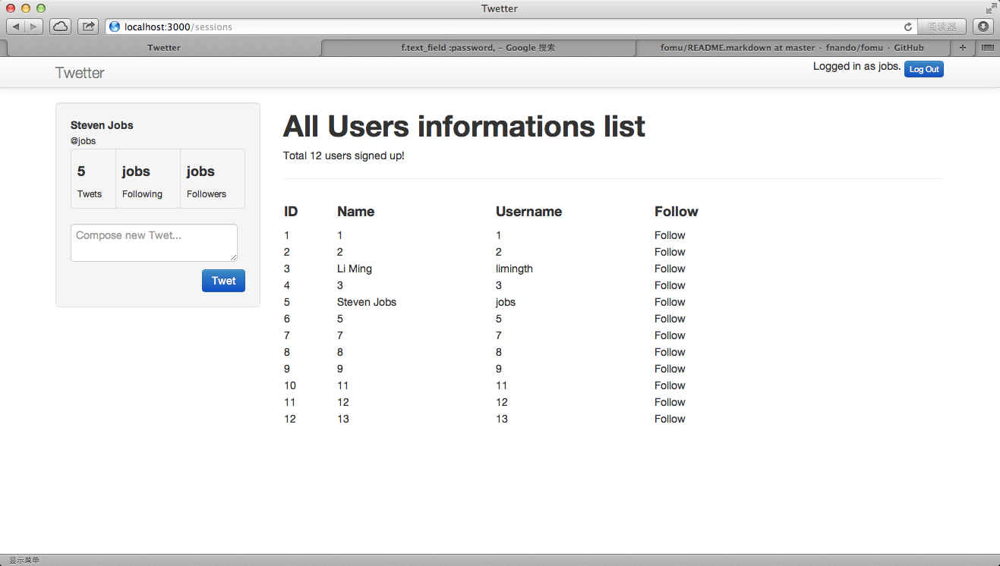

# Add Tweets data model

## Re-layout the application

### change sessions layout to authed.html.erb
	limingth@gmail ~/Github/myTwetter/Twetter$ vi app/controllers/sessions_controller.rb 
	  1 class SessionsController < ApplicationController
	  2   layout 'authed'
	  3 
	  4   def new
	  5   end

### modify sessions create method
	  7   def create
	  8     @users = User.all
	  9     user = User.find_by_username(params[:username])
	 10     if user && user.authenticate(params[:password])
	 11       session[:user_id] = user.id
	 12       render 'new', notice: "thank youfor signing up"
	 13     else
	 14       if not user
	 15         redirect_to root_url, notice: "Sorry, Signing in failed, user not exists"
	 16       else
	 17         redirect_to root_url, notice: "Sorry, Signing in failed, password not correct"
	 18       end
	 19     end
	 20   end

### add authed.html.erb
	limingth@gmail ~/Github/myTwetter/Twetter$ vi app/views/layouts/authed.html.erb
	<!DOCTYPE html>
	<html>
	<head>
	  <title>Twetter</title>
	  <%= stylesheet_link_tag    "application", media: "all", "data-turbolinks-track" => true %>
	  <%= javascript_include_tag "application", "data-turbolinks-track" => true %>
	  <%= csrf_meta_tags %>
	</head>
	<body>

	

	  

	    

	      <%= link_to "Twetter", root_path, :class => "brand" %>

	        

	          <% flash.each do |name, msg| %>
	            <%= content_tag :div, msg, id: "flash_#{name}" %>
	          <% end %>
	        

		

		   <% if current_user %>
	              Logged in as <%= current_user.username %>.
		      

			<%= link_to "Log Out", session_path("current"), method: 'delete', :class => 'btn btn-primary btn-mini' %>
		      

	           <% end %>	 
		

	     

	  

	

	

	  

	    

		

		  <ul class="nav nav-pills nav-stacked well text-left">
		    <li>
		      <%= content_tag :strong, current_user.name %>
		    </li>
		    <li>
		      <%= content_tag :small, '@'+current_user.username %>
		    </li>
		    <li>
			      <table class="table table-bordered stats">
				<tbody>
				  <tr>
				    <td>
				      <%= content_tag :h4, current_user.id %>
				      <%= content_tag :small, 'Twets', :class => "uppercase lighter" %>
				    </td>
				    <td>
				      <%= content_tag :h4, current_user.username %>
				      <%= content_tag :small, 'Following', :class => "uppercase lighter" %>
				    </td>
				    <td>
				      <%= content_tag :h4, current_user.username %>
				      <%= content_tag :small, 'Followers', :class => "uppercase lighter" %>
				    </td>
				</tbody>
			      </table>
		    </li>
		    <li>
			    <%= form_for (@twet || :twet), :url => 'twets_path',
						 :method => :POST,
						 :role => :form do |f| %>
			      

				<%= content_tag :div do %>
				  <%= f.text_area :content, :placeholder => "Compose new Twet...", :class => 'form-control', :height => "500" %>
				<% end %>
				<%= f.submit "Twet", :class => "btn btn-primary pull-right" %>
			      

			    <% end %>
		    </li>
		

	    

	    

	       <%= render :partial => 'shared/user_list' %>
	    

	  

	

	</body>
	</html>

### add _user_list.html.erb
	limingth@gmail ~/Github/myTwetter/Twetter$ vi app/views/shared/_user_list.html.erb
	<h1>All Users informations list</h1>
	Total <%= @users.count %> users signed up! 

	<table width=80%>
	

	  <tr>
	    <td width=10%><h4>ID</td>
	    <td width=30%><h4>Name</td>
	    <td width=30%><h4>Username</td>
	    <td width=30%><h4>Follow</td>
	  </tr>

	  <% @users.each do |u| %>
	  <tr>
	    <td><%= u.id %></td>
	    <td><%= u.name %></td>
	    <td><%= u.username %></td>
	    <td>Follow</td>
	  </tr>
	  <% end %>

	</table> 

### modify users create method
	limingth@gmail ~/Github/myTwetter/Twetter$ vi app/controllers/users_controller.rb 
	 13   def create
	 14     @users = User.all
	 15     @user = User.new(user_params)
	 16     if @user.save
	 17       session[:user_id] = @user.id
	 18       render 'new', notice: "thank youfor signing up"
	 19     else
	 20       redirect_to root_url, notice: "Sorry, Signing up failed"
	 21     end
	 22   end

### change sessions layout to authed.html.erb
	limingth@gmail ~/Github/myTwetter/Twetter$ vi app/controllers/users_controller.rb 
	  1 class UsersController < ApplicationController
	  2   layout 'authed'
	  3 

### try log in and sign up

* see authed.html.erb and user_list is working 

### git commit
