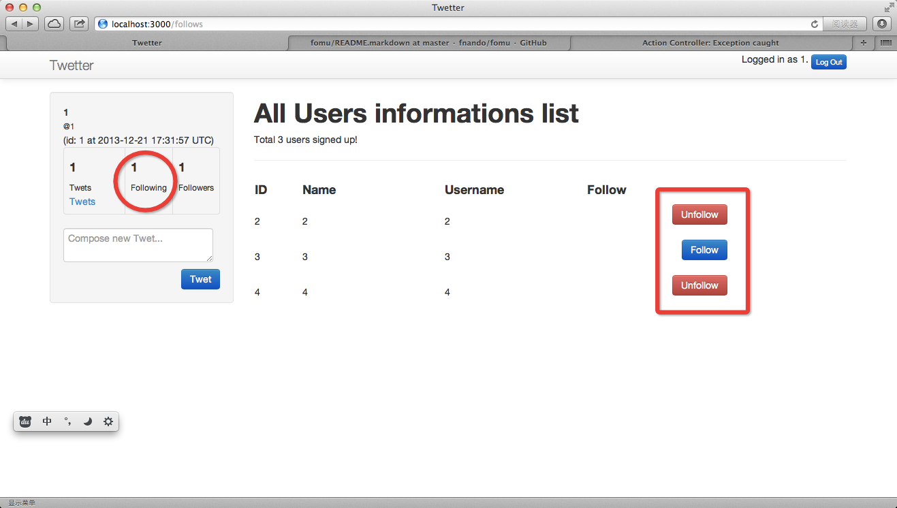
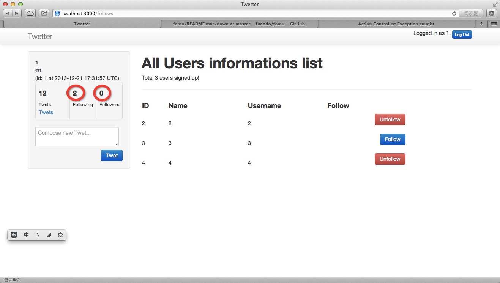
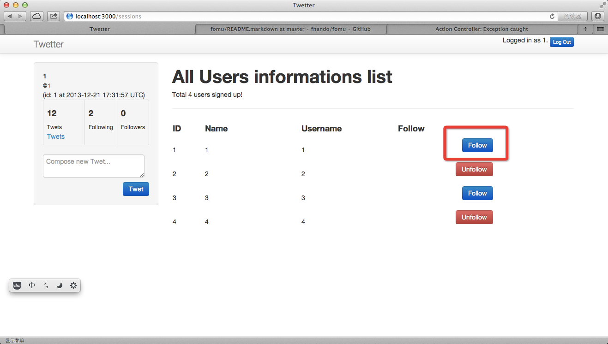
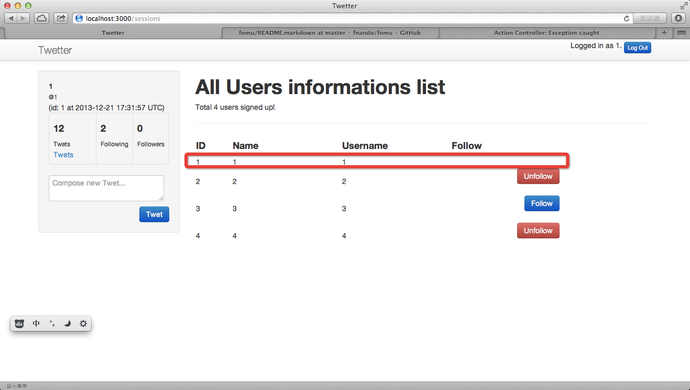

# Add Follow Model

## User can Follow other User

### add follow resource
	limingth@gmail ~/Github/myTwetter/Twetter$ rails g resource follow
	      invoke  active_record
	      create    db/migrate/20131222161357_create_follows.rb
	      create    app/models/follow.rb
	      invoke    test_unit
	      create      test/models/follow_test.rb
	      create      test/fixtures/follows.yml
	      invoke  controller
	      create    app/controllers/follows_controller.rb
	      invoke    erb
	      create      app/views/follows
	      invoke    test_unit
	      create      test/controllers/follows_controller_test.rb
	      invoke    helper
	      create      app/helpers/follows_helper.rb
	      invoke      test_unit
	      create        test/helpers/follows_helper_test.rb
	      invoke    assets
	      invoke      coffee
	      create        app/assets/javascripts/follows.js.coffee
	      invoke      scss
	      create        app/assets/stylesheets/follows.css.scss
	      invoke  resource_route
	       route    resources :follows
	limingth@gmail ~/Github/myTwetter/Twetter$ 

### add user_id and following_id to follow model

#### rails generate migration AddUser_idToFollows user_id:integer
	limingth@gmail ~/Github/myTwetter/Twetter$ rails generate migration AddUser_idToFollows user_id:integer
	      invoke  active_record
	      create    db/migrate/20131222162033_add_user_id_to_follows.rb
	limingth@gmail ~/Github/myTwetter/Twetter$ 

#### rails generate migration AddFollowing_idToFollows following_id:interger
	limingth@gmail ~/Github/myTwetter/Twetter$ rails generate migration AddFollowing_idToFollows following_id:interger
	      invoke  active_record
	      create    db/migrate/20131222162100_add_following_id_to_follows.rb
	limingth@gmail ~/Github/myTwetter/Twetter$ 

### rake db:migrate
	limingth@gmail ~/Github/myTwetter/Twetter$ rake db:migrate
	==  CreateFollows: migrating ==================================================
	-- create_table(:follows)
	   -> 0.0112s
	==  CreateFollows: migrated (0.0113s) =========================================

	==  AddUserIdToFollows: migrating =============================================
	-- add_column(:follows, :user_id, :integer)
	   -> 0.0017s
	==  AddUserIdToFollows: migrated (0.0020s) ====================================

	==  AddFollowingIdToFollows: migrating ========================================
	-- add_column(:follows, :following_id, :interger)
	   -> 0.0017s
	==  AddFollowingIdToFollows: migrated (0.0019s) ===============================

### add has_many follows to user model 
	limingth@gmail ~/Github/myTwetter/Twetter$ vi app/models/user.rb 
	  9   has_many :twets
	 10   has_many :follows

### add belongs_to user and following to follow model
	limingth@gmail ~/Github/myTwetter/Twetter$ vi app/models/follow.rb 
	class Follow < ActiveRecord::Base

	  belongs_to :following, :class_name => "User"
	  belongs_to :user

	  validates :following, :presence => true
	  validates :user, :presence => true

	end

### modify follows controllers
	limingth@gmail ~/Github/myTwetter/Twetter$ vi app/controllers/follows_controller.rb 
	class FollowsController < ApplicationController

	  def create
	    following = current_user.follows.where(:following_id => follow_params[:following_id]).first ||
	      current_user.follows.create(follow_params)
	    if following.present? and following.persisted?
	      flash[:success] = "You are following @#{following.following.username}"
	    else
	      flash[:error] = "Your attempt to follow was unsuccessful"
	    end 
	    redirect_to :action => :index
	  end 

	  def follow_params
	    params.require(:follow).permit(:following_id)
	  end 

	end

### add follow link
	limingth@gmail ~/Github/myTwetter/Twetter$ vi app/views/shared/_user_list.html.erb 
	 13   <% @users.each do |u| %>
	 14   <tr>
	 15     <td><%= u.id %></td>
	 16     <td><%= u.name %></td>
	 17     <td><%= u.username %></td>
	 18     <td><%= follow_link(u) %></td>
	 19   </tr>
	 20   <% end %>

### implement follow_link function
	limingth@gmail ~/Github/myTwetter/Twetter$ vi app/helpers/application_helper.rb 
	module ApplicationHelper

	  def follow_link(user)
	    follow = Follow.where(:user => current_user, :following => user)
	    if follow.exists?
	      button_to("Unfollow", follow_path(follow.first), :method => :delete,
	                                                       :class => 'btn btn-danger mar-top-5',
	                                                       :form => { :class => 'form-inline pull-right' })
	    else
	      form_for(:follow, :url => follows_path, :method => 'POST', :html => { :class => 'pull-right' }) do |f| 
	        f.hidden_field(:following_id, :value => user.id.to_s) +
	        f.submit('Follow', :class => "btn btn-primary mar-top-5")
	      end 
	    end 
	  end 

	end

### restart rails server and refresh web browser

* click the follow button and you will see this error message

		Unknown action
		The action 'index' could not be found for FollowsController

### add index method to follows controller
	limingth@gmail ~/Github/myTwetter/Twetter$ vi app/controllers/follows_controller.rb 
	  1 class FollowsController < ApplicationController
	  2 
	  3   def index
	  4     @users = User.all_except(current_user)
	  5   end
	  6   
	  7   def create
	  8   ...

### add all_except to user model
	limingth@gmail ~/Github/myTwetter/Twetter$ vi app/models/user.rb
	 12   def all_twets
	 13     Twet.by_user_ids(id)
	 14   end
	 15 
	 16   def self.all_except(user)
	 17     User.where(arel_table[:id].not_eq(user.id)).order(:name)
	 18   end
	 19 
	 20 end

* refresh web browser

		Template is missing
		Missing template follows/index, application/index with {:locale=>[:en], :formats=>[:html], :handlers=>[:erb, :builder, :raw, :ruby, :jbuilder, :coffee]}. Searched in: * "/Users/limingth/Github/myTwetter/Twetter/app/views" * "/Users/limingth/.rvm/gems/ruby-2.0.0-p247/gems/twitter-bootstrap-rails-2.2.8/app/views"

### add index html erb to follows
	limingth@gmail ~/Github/myTwetter/Twetter$ vi app/views/follows/index.html.erb
	  1 <h1>Follows index html</h1>

### add authed layout to follows controller
	limingth@gmail ~/Github/myTwetter/Twetter$ vi app/controllers/follows_controller.rb 
	  1 class FollowsController < ApplicationController
	  2   layout 'authed'
	  3   
	  4   def index
	  5     @users = User.all_except(current_user)
	  6   end

* refresh web browser and click follow button, you will see the follow button

* however, the following number is not right since we haven't modify the left sidebar

### modify the left sidebar
	limingth@gmail ~/Github/myTwetter/Twetter$ vi app/views/shared/_left_sidebar.html.erb 
	 12                       <table class="table table-bordered stats">
	 13                         <tbody>
	 14                           <tr>
	 15                             <td>
	 16                               <%= content_tag :h4, current_user.twets.count %>
	 17                               <%= content_tag :small, 'Twets', :class => "uppercase lighter" %>
	 18                               <a href="/twets/show">Twets</a>
	 19                             </td>
	 20                             <td>
	 21                               <%= content_tag :h4, current_user.follows.count%>
	 22                               <%= content_tag :small, 'Following', :class => "uppercase lighter" %>
	 23                             </td>
	 24                             <td>
	 25                               <%= content_tag :h4, Follow.where(:following_id => current_user.id).count %>
	 26                               <%= content_tag :small, 'Followers', :class => "uppercase lighter" %>
	 27                             </td>
	 28                         </tbody>
	 29                       </table>

* refresh web browser and you will see the Following number and Followers number are right

* log out and re-log-in, you will see one can follows oneself. It is a bug.

### modify the right sidebar
	limingth@gmail ~/Github/myTwetter/Twetter$ vi app/helpers/application_helper.rb 
	  3   def follow_link(user)
	  4     follow = Follow.where(:user => current_user, :following => user)
	  5     
	  6     if user.id == current_user.id
	  7         return
	  8     end 
	  9     

* refresh web browser and you will see No follow button at user's own row

### git commit

* click the unfollow button

		Unknown action
		The action 'destroy' could not be found for FollowsController

