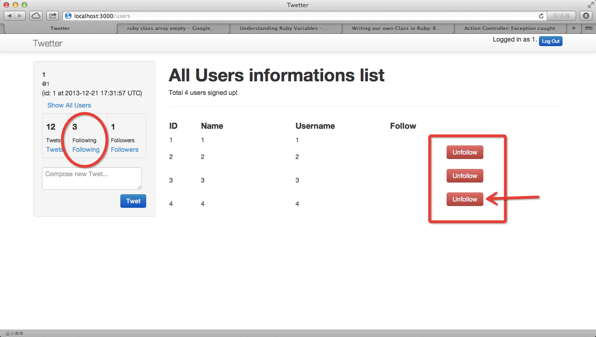
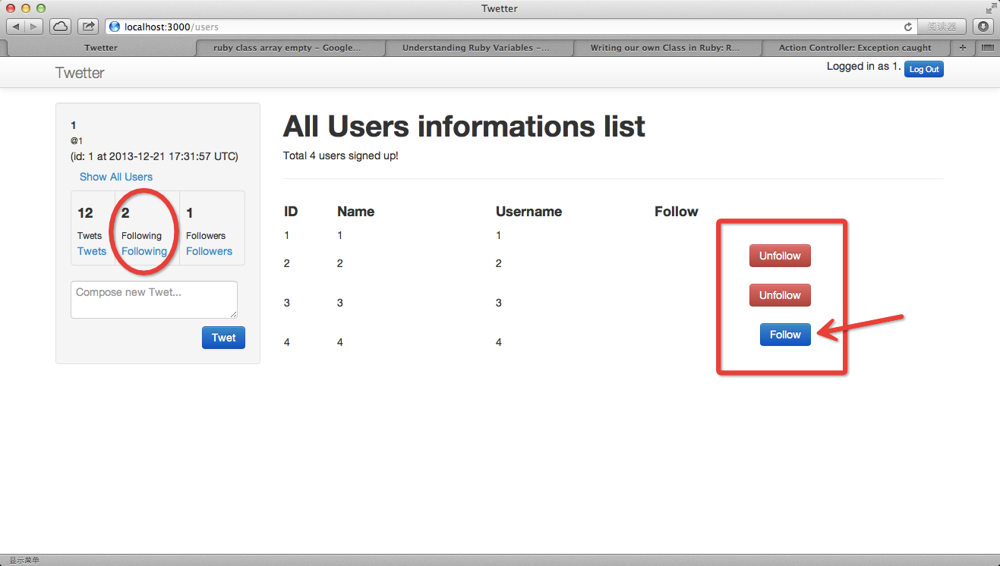
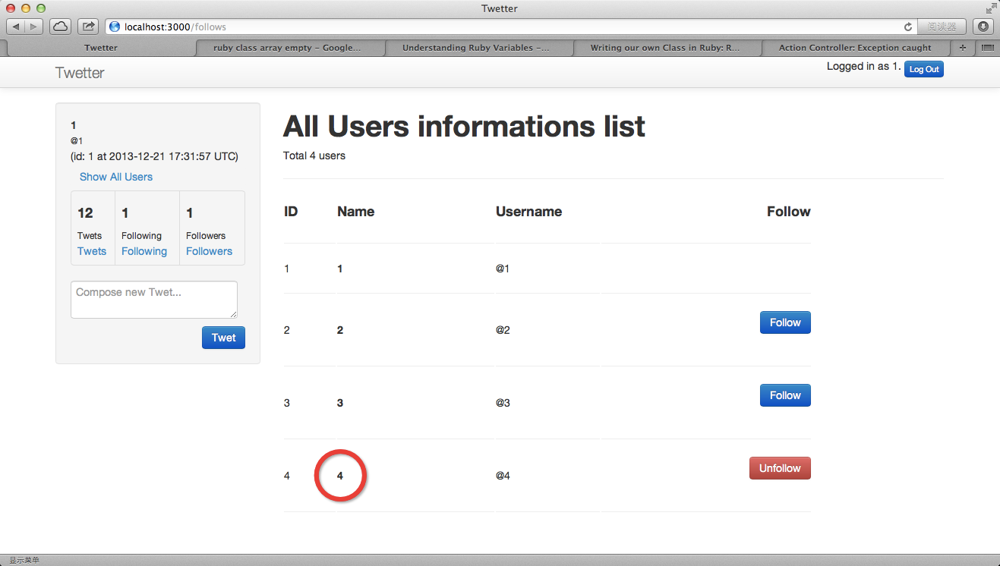
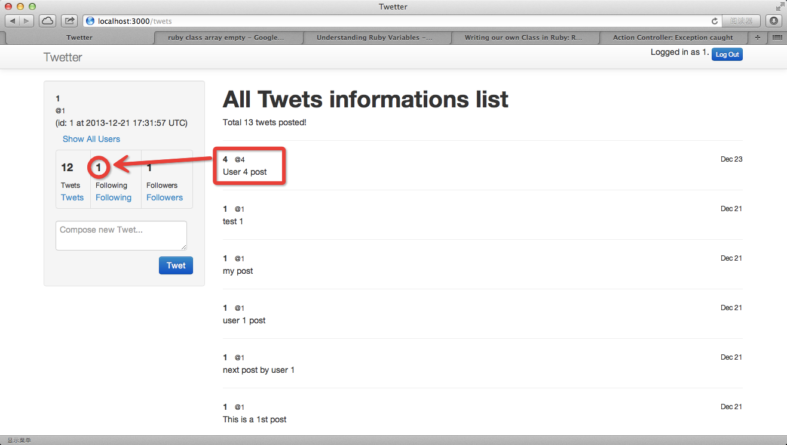

# Add Unfollow functionality

## add destroy method to follows controller
	limingth@gmail ~/Github/myTwetter/Twetter$ vi app/controllers/follows_controller.rb 
	 50   def destroy
	 51     if resource and resource.destroy
	 52       flash[:success] = "You are no longer following @#{resource.following.username}"
	 53     else
	 54       flash[:error] = "Your attempt to unfollow was not successful"
	 55     end
	 56     redirect_to :action => :index
	 57   end
	 58 
	 59   def resource
	 60     @resource ||= current_user.follows.where(:id => params[:id]).first
	 61   end

* refresh and before click unfollow button

* refresh and after click unfollow button

## modify the notice

### add @who variable to _user_list.html.erb
	limingth@gmail ~/Github/myTwetter/Twetter$ vi app/views/shared/_user_list.html.erb 
	  1 <h1>All <%= @who %> informations list</h1>
	  2 Total <%= @users.count %> users
	  3 

### add @who to follows controller
	limingth@gmail ~/Github/myTwetter/Twetter$ vi app/controllers/follows_controller.rb 
	  1 class FollowsController < ApplicationController
	  2   layout 'authed'
	  3 
	  4   @@click = "users"
	  5 
	  6   def followers
	  7     @users.clear
	  8     redirect_to :action => :index
	  9   end
	 10 
	 11   def show
	 12     @@click = params[:id]
	 13     redirect_to :action => :index
	 14   end
	 15   
	 16   def index
	 17     @users = User.all
	 18     print @@click
	 19     @who = @@click.capitalize
	 20     
	 21     if @@click == "following"
	 22       @users.clear
	 23       current_user.follows.each do |u|
	 24         @users += User.where(:id => u.following_id)
	 25       end
	 26     end
	 27     
	 28     if @@click == "followers"
	 29       @users.clear
	 30       Follow.where(:following_id => current_user.id).each do |u|
	 31         @users += User.where(:id => u.user_id) 
	 32       end
	 33     end
	 34   end

### add @who to users controller
	limingth@gmail ~/Github/myTwetter/Twetter$ vi app/controllers/users_controller.rb 
	  4   def index
	  5     @users = User.all
	  6     @user = User.new
	  7     @who = "Users"
	  8   end

* refresh and click different buttons to see if user list title changes

### git commit
	limingth@gmail ~/Github/myTwetter/Twetter$ git status
	# On branch master
	# Changes not staged for commit:
	#   (use "git add <file>..." to update what will be committed)
	#   (use "git checkout -- <file>..." to discard changes in working directory)
	#
	#	modified:   ../7-add-follow-model.md
	#	modified:   app/controllers/follows_controller.rb
	#	modified:   app/controllers/users_controller.rb
	#	modified:   app/views/shared/_user_list.html.erb
	#
	# Untracked files:
	#   (use "git add <file>..." to include in what will be committed)
	#
	#	../8-add-unfollow-functionality.md
	#	../unfollow-after.png
	#	../unfollow-before.png
	no changes added to commit (use "git add" and/or "git commit -a")
	limingth@gmail ~/Github/myTwetter/Twetter$ git add ..
	limingth@gmail ~/Github/myTwetter/Twetter$ git add .
	limingth@gmail ~/Github/myTwetter/Twetter$ git status
	# On branch master
	# Changes to be committed:
	#   (use "git reset HEAD <file>..." to unstage)
	#
	#	modified:   ../7-add-follow-model.md
	#	new file:   ../8-add-unfollow-functionality.md
	#	modified:   app/controllers/follows_controller.rb
	#	modified:   app/controllers/users_controller.rb
	#	modified:   app/views/shared/_user_list.html.erb
	#	new file:   ../unfollow-after.png
	#	new file:   ../unfollow-before.png
	#
	limingth@gmail ~/Github/myTwetter/Twetter$ git commit -a -m "Add Unfollow functionality"
	[master c4d7330] Add Unfollow functionality
	 7 files changed, 138 insertions(+), 10 deletions(-)
	 create mode 100644 8-add-unfollow-functionality.md
	 create mode 100644 unfollow-after.png
	 create mode 100644 unfollow-before.png
	limingth@gmail ~/Github/myTwetter/Twetter$ git push
	Counting objects: 23, done.
	Delta compression using up to 2 threads.
	Compressing objects: 100% (14/14), done.
	Writing objects: 100% (14/14), 195.06 KiB | 0 bytes/s, done.
	Total 14 (delta 10), reused 0 (delta 0)
	To git@github.com:limingth/myTwetter.git
	   b523a04..c4d7330  master -> master
	limingth@gmail ~/Github/myTwetter/Twetter$ 

## Change UI for user list and twet list

### change user list view 
	limingth@gmail ~/Github/myTwetter/Twetter$ vi app/views/shared/_user_list.html.erb 
	<h1>All <%= @who %> informations list</h1>
	Total <%= @users.count %> users 

	<table width=80%>
	

	  <tr>
	    <td width=10%><h4>ID</td>
	    <td width=30%><h4>Name</td>
	    <td width=20%><h4>Username</td>
	    <td width=40% align=right><h4>Follow</td>
	  </tr>
	

	

	  <tr>
	    <td width=10%>
</td>
	    <td width=10%>
</td>
	    <td width=10%>
</td>
	    <td width=10%>
</td>
	  </tr>

	  <% @users.each do |u| %>
	  <tr>
	    <td><%= u.id %></td>
	    <td>
	      <%= content_tag :strong, u.name, :class => 'pull-left text-middle' %>
	    </td>
	    <td>
	      <%= content_tag :span, "@"+u.username, :class => 'text-muted pad-10 text-middle' %>
	    </td>
	    <td><%= follow_link(u) %></td>
	  </tr>
	  <tr>
	    <td width=10%>
</td>
	    <td width=10%>
</td>
	    <td width=10%>
</td>
	    <td width=10%>
</td>
	  </tr>
	  <% end %>

	</table>

### change Show All Users link to follows/users
	limingth@gmail ~/Github/myTwetter/Twetter$ vi app/views/shared/_left_sidebar.html.erb 
	  7             <li>
	  8               <%= content_tag :small, '@'+current_user.username %>
	  9                 (id: <%= current_user.id %> at <%= current_user.created_at %>)
	 10                 <a href="/follows/users">Show All Users</a>
	 11             </li>

### change twet list view
	limingth@gmail ~/Github/myTwetter/Twetter$ vi app/views/shared/_twet_list.html.erb 
	<h1>All Twets informations list</h1>
	Total <%= @twets.count %> twets posted!
	

	<% @twets.each do |twet| %>

	  <%= content_tag :strong, twet.user.name, :class => 'pull-left text-middle' %>  &nbsp;&nbsp; 
	  <%= content_tag :small, "@"+twet.user.username, :class => 'text-muted pad-10 text-middle' %>
	  <%= content_tag :small, twet.created_at.strftime("%b %-d"), :class => 'text-muted text-middle pull-right' %>
	  

	  <%= content_tag :p, twet.content %>

	  

	<% end %>

* refresh and see new user list view and twet list view

### git commit 
	limingth@gmail ~/Github/myTwetter/Twetter$ git status
	# On branch master
	# Changes not staged for commit:
	#   (use "git add <file>..." to update what will be committed)
	#   (use "git checkout -- <file>..." to discard changes in working directory)
	#
	#	modified:   ../8-add-unfollow-functionality.md
	#	modified:   app/controllers/follows_controller.rb
	#	modified:   app/views/shared/_left_sidebar.html.erb
	#	modified:   app/views/shared/_twet_list.html.erb
	#	modified:   app/views/shared/_user_list.html.erb
	#
	# Untracked files:
	#   (use "git add <file>..." to include in what will be committed)
	#
	#	../new-twet-list.png
	#	../new-user-list.png
	no changes added to commit (use "git add" and/or "git commit -a")
	limingth@gmail ~/Github/myTwetter/Twetter$ git add ..
	limingth@gmail ~/Github/myTwetter/Twetter$ git add .
	limingth@gmail ~/Github/myTwetter/Twetter$ git commit -a -m "Change UI for user list and twet list"
	[master 209616e] Change UI for user list and twet list
	 7 files changed, 164 insertions(+), 25 deletions(-)
	 rewrite Twetter/app/views/shared/_twet_list.html.erb (71%)
	 create mode 100644 new-twet-list.png
	 create mode 100644 new-user-list.png
	limingth@gmail ~/Github/myTwetter/Twetter$ git push
	Counting objects: 24, done.
	Delta compression using up to 2 threads.
	Compressing objects: 100% (14/14), done.
	Writing objects: 100% (14/14), 260.25 KiB | 0 bytes/s, done.
	Total 14 (delta 8), reused 0 (delta 0)
	To git@github.com:limingth/myTwetter.git
	   c4d7330..209616e  master -> master
	limingth@gmail ~/Github/myTwetter/Twetter$ 
